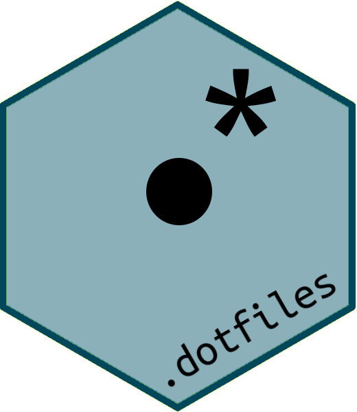

# .dotfiles 

This repository  is to automatically install  packages and user configuration on a new system  in [my](https://github.com/danlooo) preferred way.

## Get started

Install:

```sh
git clone  https://github.com/danlooo/dotfiles ~/.dotfiles
sudo sh /.dotfiles/bootstrap_system.sh 
zsh ~/.dotfiles/bootstrap_user.zsh 
exec zsh
```

Or use docker:
```sh
docker run -it dotfiles
```

## Contribute

-  Install packages and do system wide changes which  might  need root privileges: [bootstrap_system.sh](bootstrap_system.sh)
-  Install user packages and link  dotfiles:  [bootstrap_user.zsh](bootstrap_user.zsh)
-  User  dotfiles relative to the home directory of that user: [home](home)